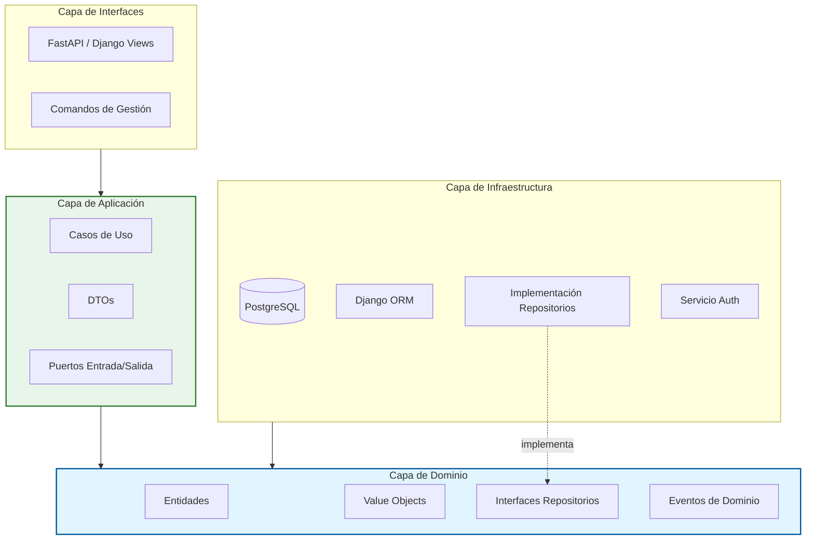

<div align="center">

# Sistema Empresarial de Gestión - Clean Architecture

### Sistema Empresarial con CQRS y Arquitectura Orientada a Eventos

[](https://www.python.org/)
[](https://www.djangoproject.com/)
[](https://www.postgresql.org/)
[](https://fastapi.tiangolo.com/)
[](LICENSE)

</div>

---

## 📋 Visión General

Este proyecto es un sistema empresarial diseñado estrictamente siguiendo **Clean Architecture**, **Domain-Driven Design (DDD)**, y patrones **CQRS**. Desacopla la lógica de negocio de los frameworks externos, asegurando mantenibilidad, testabilidad y escalabilidad.

Este proyecto demuestra cómo construir aplicaciones Python complejas donde las reglas de negocio están protegidas de cambios tecnológicos (como cambiar la base de datos o el framework web).

---

## 🏗️ Arquitectura

Este proyecto implementa **Clean Architecture / Hexagonal Architecture** estrictamente.

### Capas

El sistema está organizado en capas concéntricas, con dependencias apuntando **hacia adentro**. Las capas internas no conocen nada de las externas.

```text
src/
├── domain/         # Núcleo de negocio (sin dependencias externas)
├── application/    # Casos de uso y lógica de aplicación
├── infrastructure/ # Implementaciones técnicas (DB, logging, etc.)
├── interfaces/     # APIs y puntos de entrada
└── shared/         # Componentes compartidos
```



### Principios

*   **Dominio puro**: Sin dependencias a frameworks (Django, FastAPI), SQL o HTTP.
*   **Inversión de dependencias**: La infraestructura depende del dominio, nunca al revés.
*   **Separación de responsabilidades**: Cada capa tiene un propósito claro.
*   **Preparado para escalar**: Arquitectura orientada a eventos (Event-Driven) lista para implementar.

---

## 🚀 Características

*   **Cumplimiento Estricto de Clean Architecture**: Sin fugas de framework en la lógica de negocio.
*   **CQRS Ready**: Modelos separados para Lectura (Queries) y Escritura (Commands).
*   **Event-Driven**: Eventos de dominio para efectos secundarios (ej. "Enviar email cuando se crea orden").
*   **Soporte Dual de Framework**: Usa Django para Admin/ORM y FastAPI para APIs asíncronas de alto rendimiento.
*   **Manejo Robusto de Errores**: Manejo de excepciones centralizado mapeado a códigos de estado HTTP.

---

## 🛠️ Tecnologías Base

| Componente | Tecnología | Versión | Propósito |
|---|---|---|---|
| **Lenguaje** | Python | 3.14+ | Lógica principal y tipado |
| **Framework** | Django | 6.0 | ORM, Panel de Admin, Migraciones |
| **API** | FastAPI | 0.128 | API REST Async de alto rendimiento |
| **Base de Datos** | PostgreSQL | 18.1 | Almacenamiento de Datos (Desacoplado por repositorios) |
| **Linting** | Black / Flake8 | Latest | Calidad de código y formato |

---

## 📂 Estructura del Proyecto

```bash
src/
├── domain/                  # 🧠 LÓGICA DE NEGOCIO (Python Puro)
│   ├── entities/            # Objetos de Negocio (Cliente, Producto, Orden)
│   ├── value_objects/       # Atributos inmutables (Email, Dinero)
│   ├── repositories/        # Interfaces solamente!
│   └── events/              # Eventos de Dominio
│
├── application/             # 💼 ORQUESTACIÓN
│   ├── use_cases/           # Reglas de negocio específicas de la aplicación
│   └── dto/                 # Contratos de datos
│
├── infrastructure/          # 🔌 ADAPTADORES & IO
│   ├── persistence/         # Implementación de Repositorios (Django ORM)
│   ├── logging/             # Adaptadores de logging
│   └── config/              # Configuraciones del Framework
│
├── interfaces/              # 🗣️ MECANISMOS DE ENTREGA
│   ├── api/                 # Rutas FastAPI
│   └── management/          # Comandos CLI
│
└── shared/                  # 🔗 COMPONENTES COMPARTIDOS
    ├── exceptions/          # Excepciones base
    └── utils/               # Utilidades generales
```

---

## 💻 Comenzando

### Prerrequisitos
*   Python 3.14+
*   PostgreSQL

### Instalación

1.  **Clonar el repositorio**
    ```bash
    git clone https://github.com/tu-repo/ecommerce.git
    cd ecommerce
    ```

2.  **Crear Entorno Virtual**
    ```bash
    python -m venv venv
    # Windows:
    .\venv\Scripts\activate
    # Linux/Mac:
    source venv/bin/activate
    ```

3.  **Instalar Dependencias**
    ```bash
    pip install -r requirements.txt
    ```

4.  **Configuración**
    Copia el archivo de ejemplo y actualiza tus credenciales de BD:
    ```bash
    cp .env.example .env
    ```

5.  **Ejecutar Migraciones**
    ```bash
    python manage.py migrate
    ```

6.  **Ejecutar Servidor de Desarrollo**
    *   **Django (Admin/Comandos)**: `python manage.py runserver`
    *   **FastAPI (API)**: `uvicorn src.main:app --reload`

---

## 🧪 Pruebas

Usamos `pytest` para pruebas exhaustivas.

```bash
# Ejecutar todas las pruebas
pytest

# Ejecutar solo pruebas de dominio (Rápidas, sin BD)
pytest tests/domain/

# Ejecutar con cobertura
pytest --cov=src --cov-report=html
```

---

## 📚 Documentación y UML

Este proyecto mantiene diagramas UML detallados para visualizar la arquitectura.
Ver [**docs/UML_DIAGRAMS.md**](docs/UML_DIAGRAMS.md) para:
*   Diagramas de Clases (Relaciones de dominio)
*   Diagramas de Secuencia (Flujo de peticiones)
*   Diagramas ER (Esquema de Base de Datos)

---

<div align="center">
    <sub>Construido con ❤️ usando principios de Clean Architecture.</sub>
</div>
