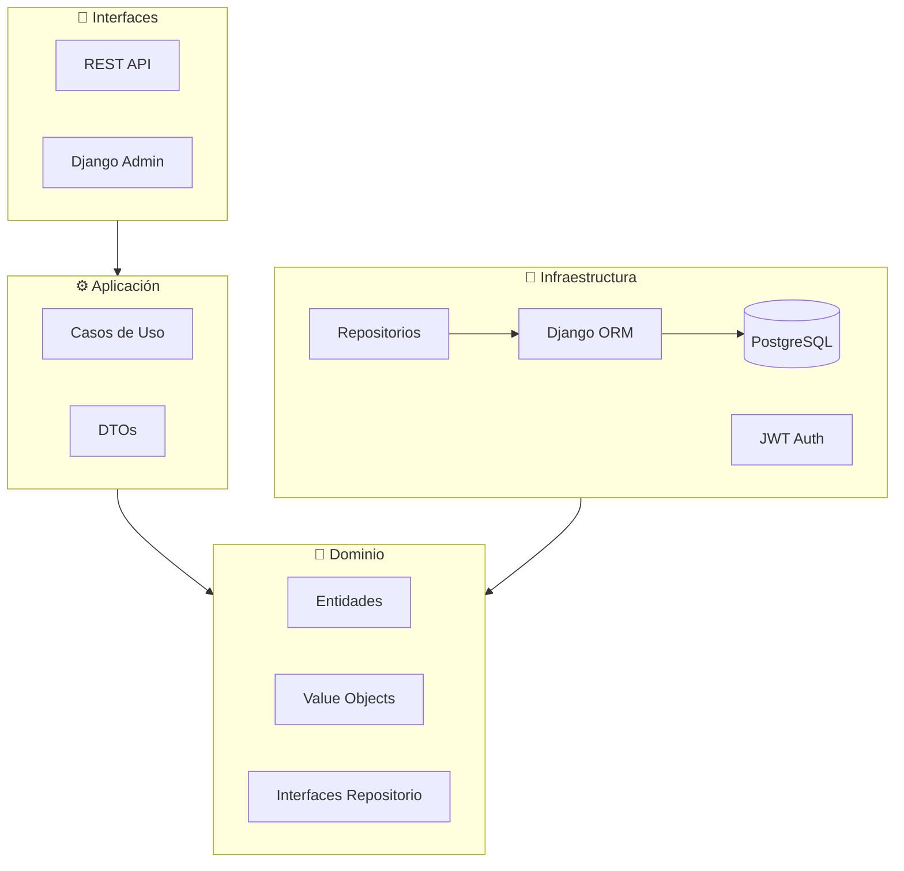
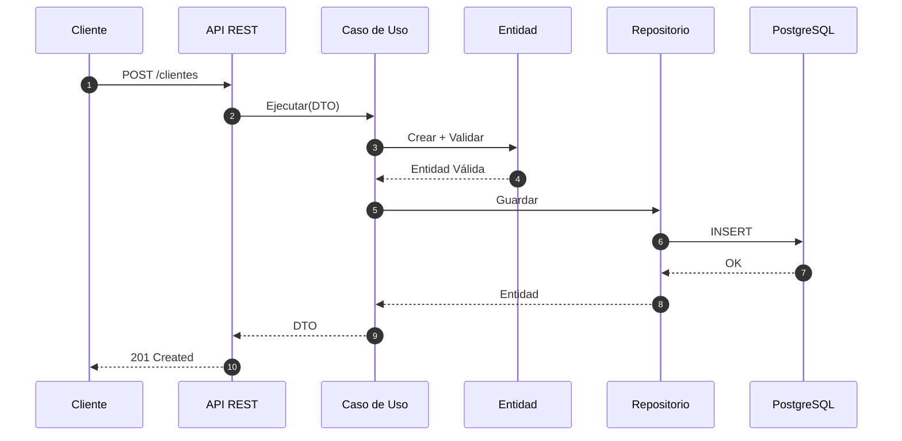
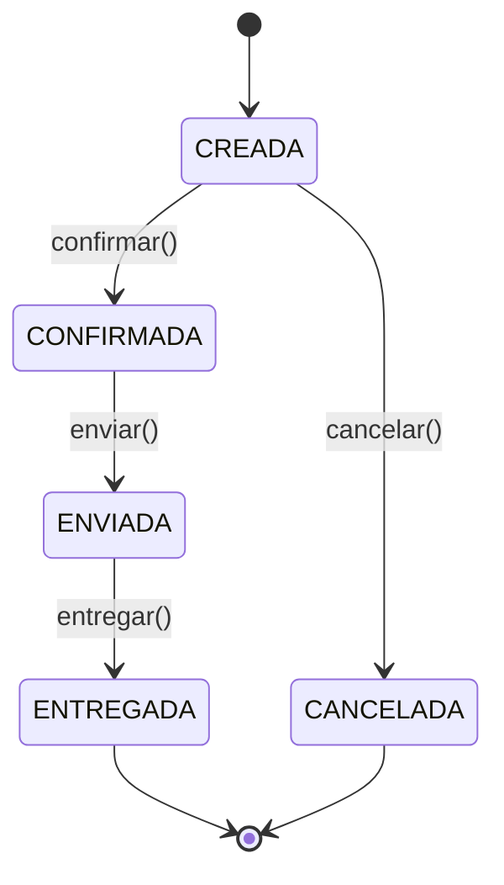
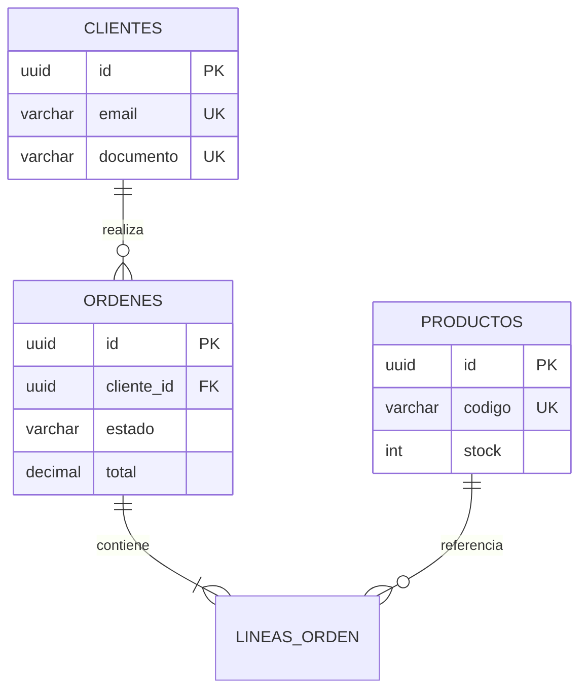

# 🏢 Sistema E-Commerce - Clean Architecture

[](https://www.python.org/)
[](https://www.djangoproject.com/)
[](https://www.postgresql.org/)
[](https://www.django-rest-framework.org/)
[](https://jwt.io/)

Sistema empresarial de e-commerce implementando **Clean Architecture**, **Domain-Driven Design (DDD)** y patrones empresariales modernos con autenticación JWT y protección anti-abuso.

---

## 📋 Índice

- [Arquitectura](#-arquitectura)
- [Instalación](#-instalación)
- [Configuración](#-configuración)
- [API REST](#-api-rest)
- [Autenticación](#-autenticación)
- [Dominio](#-capa-de-dominio)
- [Infraestructura](#-capa-de-infraestructura)
- [Seguridad](#-seguridad)
- [Testing](#-testing)

---

## 🏗️ Arquitectura

### Capas del Sistema

```
┌──────────────────────────────────────────┐
│  Interfaces (API REST / Django Admin)   │ ← Adaptadores de entrada
├──────────────────────────────────────────┤
│  Application (Use Cases / DTOs)          │ ← Orquestación
├──────────────────────────────────────────┤
│  Domain (Entities / Value Objects)       │ ← NÚCLEO (Reglas de negocio)
├──────────────────────────────────────────┤
│  Infrastructure (ORM / Repos / Auth)     │ ← Adaptadores de salida
└──────────────────────────────────────────┘
```

**Regla de Dependencia:** Las capas externas dependen de las internas. El dominio NO depende de nada.

### Diagrama de Componentes



### Flujo de Datos (CQRS)



---

## 🚀 Instalación

### Requisitos

- Python 3.14+
- PostgreSQL 16+
- Git

### Pasos

```bash
# Clonar
git clone <repo-url>
cd e-comerce

# Entorno virtual
python -m venv .venv
.\.venv\Scripts\Activate.ps1  # Windows
source .venv/bin/activate      # Linux/Mac

# Dependencias
pip install -r requirements.txt
```

---

## ⚙️ Configuración

### Variables de Entorno

Crear archivo `.env` en la raíz:

```env
# Django
DJANGO_SECRET_KEY=<generar-key-segura>
DJANGO_DEBUG=True
DJANGO_ALLOWED_HOSTS=localhost,127.0.0.1
DJANGO_ENVIRONMENT=development

# PostgreSQL
DB_NAME=ecomerce_db
DB_USER=postgres
DB_PASSWORD=<password>
DB_HOST=localhost
DB_PORT=5432

# JWT (opcional - valores por defecto)
JWT_ACCESS_TOKEN_LIFETIME_MINUTES=60
JWT_REFRESH_TOKEN_LIFETIME_DAYS=7
```

**Generar SECRET_KEY:**
```bash
python -c "from django.core.management.utils import get_random_secret_key; print(get_random_secret_key())"
```

### Inicializar BD

```bash
python manage.py migrate
python manage.py crear_usuarios_demo  # Usuarios de prueba
python manage.py runserver
```

---

## 📡 API REST

**Base URL:** `http://localhost:8000/api/v1/`

### Endpoints Públicos

| Método | Endpoint | Descripción |
|--------|----------|-------------|
| POST | `/auth/login/` | Obtener tokens JWT |
| POST | `/auth/refresh/` | Renovar access token |

### Endpoints Protegidos

| Método | Endpoint | Rol Mínimo | Descripción |
|--------|----------|------------|-------------|
| GET | `/clientes/` | viewer | Listar clientes |
| POST | `/clientes/` | operator | Crear cliente |
| GET | `/productos/` | viewer | Listar productos |
| POST | `/productos/` | operator | Crear producto |
| POST | `/ordenes/` | operator | Crear orden |
| POST | `/ordenes/{id}/confirmar/` | operator | Confirmar orden |

### Ejemplo: Flujo Completo

```bash
# 1. Login
curl -X POST http://localhost:8000/api/v1/auth/login/ \
  -H "Content-Type: application/json" \
  -d '{"username": "operador", "password": "Operador123!"}'

# Respuesta: {"access": "eyJ...", "refresh": "eyJ..."}

# 2. Crear cliente (con token)
curl -X POST http://localhost:8000/api/v1/clientes/ \
  -H "Authorization: Bearer eyJ..." \
  -H "Content-Type: application/json" \
  -d '{
    "nombre": "Juan",
    "apellido": "Pérez",
    "email": "juan@example.com",
    "tipo_documento": "DNI",
    "numero_documento": "12345678"
  }'

# 3. Crear producto
curl -X POST http://localhost:8000/api/v1/productos/ \
  -H "Authorization: Bearer eyJ..." \
  -H "Content-Type: application/json" \
  -d '{
    "codigo": "SKU-001",
    "nombre": "Laptop",
    "precio_monto": 1500.00,
    "stock_actual": 50
  }'
```

---

## 🔐 Autenticación

El sistema usa **JWT (JSON Web Tokens)** con refresh tokens.

### Usuarios Demo

| Usuario | Contraseña | Rol |
|---------|------------|-----|
| admin | Admin123! | admin |
| operador | Operador123! | operator |
| visor | Visor123! | viewer |

### Roles y Permisos

| Rol | Permisos |
|-----|----------|
| **admin** | CRUD completo + gestión usuarios |
| **operator** | Crear, leer, actualizar |
| **viewer** | Solo lectura |

📖 **Documentación completa:** [docs/AUTENTICACION_JWT.md](docs/AUTENTICACION_JWT.md)

---

## 💎 Capa de Dominio

### Entidades

#### Cliente
```python
class Cliente(EntidadBase):
    nombre: str
    apellido: str
    email: Email          # Value Object
    documento: DocumentoIdentidad  # Value Object
    telefono: Telefono    # Value Object (opcional)
    activo: bool
```

#### Producto
```python
class Producto(EntidadBase):
    codigo: CodigoProducto
    nombre: str
    precio: Dinero        # Value Object
    stock_actual: int
    
    def reservar_stock(self, cantidad: int):
        if cantidad > self.stock_actual:
            raise ReglaNegocioViolada("Stock insuficiente")
        self.stock_actual -= cantidad
```

#### Orden (Máquina de Estados)



### Value Objects

Encapsulan validaciones y garantizan inmutabilidad:

| Value Object | Validación |
|--------------|------------|
| `Email` | Formato RFC 5322 |
| `Telefono` | Mínimo 8 dígitos |
| `Dinero` | Monto >= 0, moneda válida |
| `DocumentoIdentidad` | Tipo + número válido |

### Excepciones de Dominio

```python
ExcepcionDominio       # Base
├── ValorInvalido      # VO inválido → HTTP 400
├── ReglaNegocioViolada # Lógica violada → HTTP 409
├── EntidadNoEncontrada # No existe → HTTP 404
└── EstadoInvalido     # Transición inválida → HTTP 409
```

---

## 🔌 Capa de Infraestructura

### Repositorios

Implementan interfaces del dominio con Django ORM:

```python
class ClienteRepositoryImpl(ClienteRepository):
    def guardar(self, entidad: Cliente) -> Cliente:
        model = self._to_model(entidad)
        model.save()
        self._auditoria.registrar("clientes", "CREATE", ...)
        return self._to_domain(model)
```

### Control de Concurrencia

**Bloqueo pesimista** para operaciones de stock:

```python
def obtener_con_bloqueo(self, id: UUID) -> Producto:
    # SELECT ... FOR UPDATE
    model = ProductoModel.objects.select_for_update().get(id=id)
    return self._to_domain(model)
```

### Modelo de Datos



---

## 🔒 Seguridad

### Protección Implementada

| Capa | Mecanismo |
|------|-----------|
| **Autenticación** | JWT con refresh tokens |
| **Autorización** | RBAC (roles y permisos) |
| **Rate Limiting** | 100 req/min anónimos, 1000 auth |
| **Headers** | HSTS, X-Frame-Options, CSP |
| **Auditoría** | Log de todos los accesos |

### Rate Limiting

```python
# Límites por defecto
THROTTLE_RATES = {
    'anon': '100/minute',      # No autenticado
    'user': '1000/minute',     # Autenticado
    'auth': '5/minute',        # Endpoints de auth
}
```

📖 **Documentación completa:** [docs/PROTECCION_ANTI_ABUSO.md](docs/PROTECCION_ANTI_ABUSO.md)

---

## 🧪 Testing

### Scripts de Verificación

```bash
# Verificar API completa
python scripts/verify_api_rest.py

# Test de autenticación
python scripts/test_api_auth.py

# Test de rate limiting
python scripts/test_rate_limit.py

# Test de concurrencia
python scripts/test_concurrencia_stock.py
```

### Flujo E2E

El script `verify_api_rest.py` ejecuta:
1. ✅ Login y obtención de token
2. ✅ Creación de cliente
3. ✅ Creación de producto
4. ✅ Creación de orden
5. ✅ Agregar línea a orden
6. ✅ Confirmación de orden (descuenta stock)

---

## 📁 Estructura del Proyecto

```
e-comerce/
├── src/
│   ├── domain/              # 💎 Núcleo (Python puro)
│   │   ├── entities/        # Cliente, Producto, Orden
│   │   ├── value_objects/   # Email, Dinero, etc.
│   │   ├── repositories/    # Interfaces
│   │   └── exceptions/      # Excepciones de dominio
│   │
│   ├── application/         # ⚙️ Casos de Uso
│   │   ├── use_cases/       # Lógica de aplicación
│   │   └── dto/             # Data Transfer Objects
│   │
│   ├── infrastructure/      # 🔌 Adaptadores
│   │   ├── persistence/     # Django ORM
│   │   ├── auth/            # JWT + Usuarios
│   │   ├── auditing/        # Sistema de auditoría
│   │   └── config/          # Django settings
│   │
│   └── interfaces/          # 📡 API REST
│       ├── api/rest/        # Views, Serializers
│       └── permissions/     # RBAC
│
├── docs/                    # Documentación adicional
├── scripts/                 # Scripts de testing
└── manage.py
```

---

## 🛠️ Comandos Útiles

```bash
# Servidor de desarrollo
python manage.py runserver

# Crear usuarios demo
python manage.py crear_usuarios_demo

# Migraciones
python manage.py makemigrations
python manage.py migrate

# Shell interactivo
python manage.py shell

# Producción (Gunicorn)
gunicorn --bind 0.0.0.0:8000 --workers 4 infrastructure.config.django_wsgi:application
```

---

## 📚 Documentación Adicional

- [Autenticación JWT](docs/AUTENTICACION_JWT.md) - Configuración y uso del sistema de autenticación
- [Protección Anti-Abuso](docs/PROTECCION_ANTI_ABUSO.md) - Rate limiting y throttling
- [Instrucciones de Activación](INSTRUCCIONES_ACTIVACION_AUTH.md) - Guía paso a paso

---

## 📝 Stack Tecnológico

| Componente | Tecnología |
|------------|------------|
| **Lenguaje** | Python 3.14+ |
| **Framework** | Django 6.0 |
| **API** | Django REST Framework 3.15 |
| **Base de Datos** | PostgreSQL 18 |
| **Autenticación** | Simple JWT |
| **ORM** | Django ORM |

---

**Última actualización:** 2026-01-17
