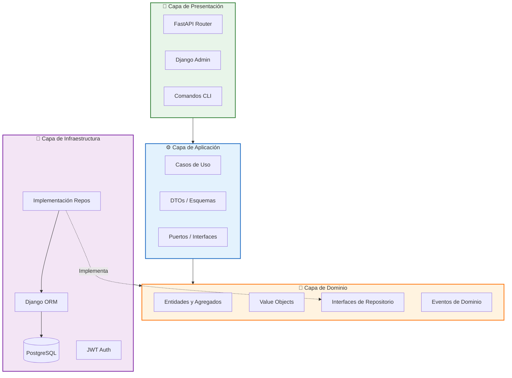
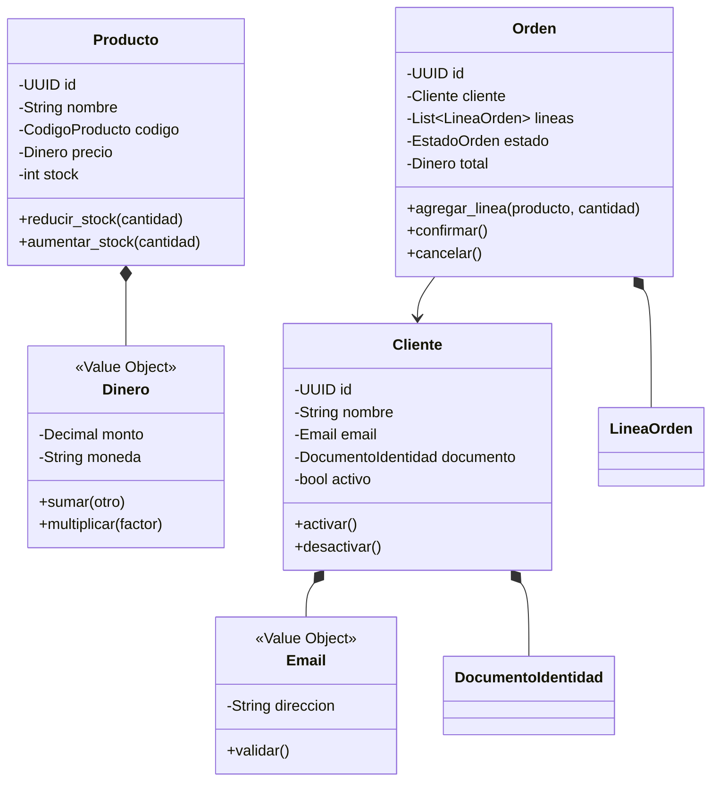
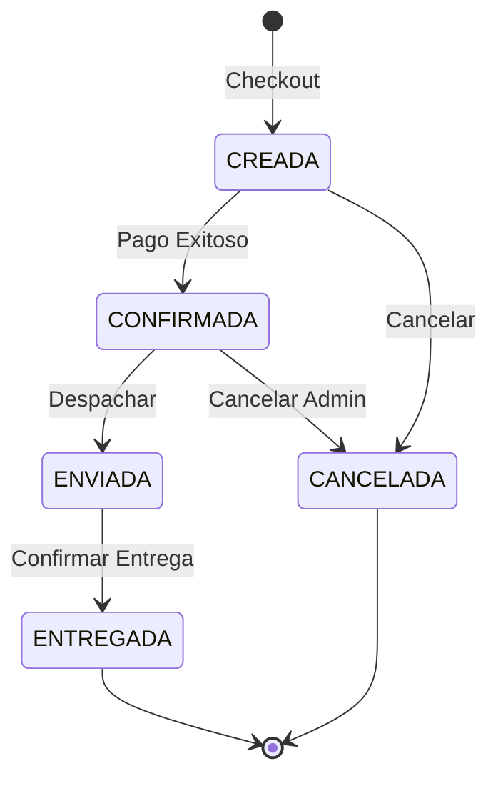
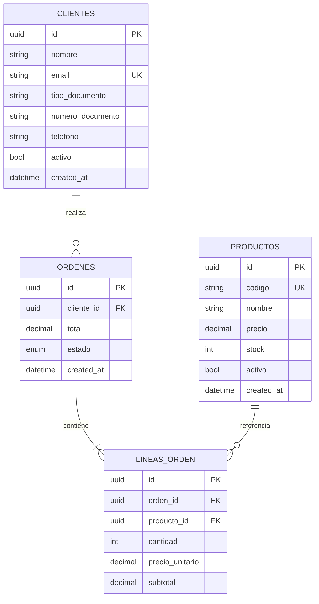

<div align="center">

# 🏢 Sistema E-Commerce - Clean Architecture

### Arquitectura Empresarial con DDD, CQRS, JWT Auth y Event-Driven Design

[](https://www.python.org/)
[](https://www.djangoproject.com/)
[](https://www.postgresql.org/)
[](https://fastapi.tiangolo.com/)
[](https://jwt.io/)
[](https://blog.cleancoder.com/uncle-bob/2012/08/13/the-clean-architecture.html)

</div>

---

## 📋 Tabla de Contenidos

- [Visión General](#-visión-general)
- [Arquitectura del Sistema](#-arquitectura-del-sistema)
- [Stack Tecnológico](#-stack-tecnológico)
- [Estructura del Proyecto](#-estructura-del-proyecto)
- [Instalación](#-instalación)
- [Configuración](#-configuración)
- [Autenticación y Seguridad](#-autenticación-y-seguridad)
- [API REST](#-api-rest)
- [Modelado de Dominio](#-modelado-de-dominio)
- [Base de Datos](#-base-de-datos)
- [Mejoras Operativas para Producción](#-mejoras-operativas-para-producción)
- [Testing](#-testing)

---

## 📋 Visión General

Sistema e-commerce empresarial implementado con **Clean Architecture** y principios de **Domain-Driven Design (DDD)**. Diseñado para desacoplar completamente la lógica de negocio de la infraestructura tecnológica.

### Características Principales

- ✅ **Clean Architecture**: Separación estricta en capas con inversión de dependencias
- ✅ **Domain-Driven Design**: Entidades, Value Objects, Agregados y Eventos de Dominio
- ✅ **CQRS**: Separación de operaciones de lectura y escritura
- ✅ **Autenticación JWT**: Tokens de acceso con refresh rotativo
- ✅ **RBAC**: Control de acceso basado en roles (Admin, Operador, Lectura)
- ✅ **Rate Limiting**: Protección anti-abuso con throttling configurable
- ✅ **Auditoría**: Registro automático de todos los accesos a la API
- ✅ **API REST**: Endpoints documentados con OpenAPI/Swagger

---

## 🏗️ Arquitectura del Sistema

La arquitectura está diseñada concéntricamente. Las dependencias fluyen **únicamente hacia adentro**, protegiendo el Dominio de cambios externos.

```
┌─────────────────────────────────────────────────────────────────┐
│                    📱 INTERFACES LAYER                          │
│         FastAPI Router │ Django Admin │ CLI Commands            │
├─────────────────────────────────────────────────────────────────┤
│                    ⚙️ APPLICATION LAYER                         │
│           Use Cases │ DTOs │ Commands │ Queries                 │
├─────────────────────────────────────────────────────────────────┤
│                    💎 DOMAIN LAYER (Núcleo)                     │
│    Entities │ Value Objects │ Repository Interfaces │ Events   │
├─────────────────────────────────────────────────────────────────┤
│                    🔌 INFRASTRUCTURE LAYER                      │
│      Django ORM │ PostgreSQL │ JWT │ Auditing │ External APIs   │
└─────────────────────────────────────────────────────────────────┘
                              ▲
                              │
              Las dependencias fluyen HACIA ADENTRO
```

### Diagrama de Componentes



---

## 🛠️ Stack Tecnológico

| Capa | Tecnología | Rol |
|------|------------|-----|
| **Dominio** | Python Puro | Reglas de negocio, Entidades, Value Objects |
| **Aplicación** | Python | Casos de uso, DTOs, Validaciones |
| **Infraestructura** | Django 6.0 | ORM, Admin, Migraciones |
| **API** | FastAPI | Endpoints REST de alto rendimiento |
| **Auth** | SimpleJWT | Autenticación con tokens JWT |
| **Base de Datos** | PostgreSQL 18 | Persistencia relacional |
| **Testing** | PyTest | Pruebas unitarias e integración |

---

## 📁 Estructura del Proyecto

```
e-commerce/
├── manage.py                 # Entry point Django
├── requirements.txt          # Dependencias Python
├── .env                      # Variables de entorno (no versionado)
│
├── src/
│   ├── main.py              # Configuración FastAPI + Django
│   │
│   ├── domain/              # 💎 CAPA DE DOMINIO
│   │   ├── entities/        # Entidades de negocio
│   │   │   ├── cliente.py
│   │   │   ├── producto.py
│   │   │   └── orden.py
│   │   ├── value_objects/   # Objetos de valor inmutables
│   │   │   ├── email.py
│   │   │   ├── dinero.py
│   │   │   ├── documento_identidad.py
│   │   │   └── telefono.py
│   │   ├── repositories/    # Interfaces de repositorio
│   │   ├── events/          # Eventos de dominio
│   │   └── exceptions/      # Excepciones de dominio
│   │
│   ├── application/         # ⚙️ CAPA DE APLICACIÓN
│   │   ├── use_cases/       # Casos de uso
│   │   │   ├── cliente_use_cases.py
│   │   │   ├── producto_use_cases.py
│   │   │   └── orden_use_cases.py
│   │   ├── dto/             # Data Transfer Objects
│   │   ├── commands/        # Comandos CQRS
│   │   └── queries/         # Queries CQRS
│   │
│   ├── infrastructure/      # 🔌 CAPA DE INFRAESTRUCTURA
│   │   ├── auth/            # Sistema de autenticación
│   │   │   ├── models.py    # Usuario con roles
│   │   │   └── middleware.py
│   │   ├── persistence/     # Implementación de repositorios
│   │   │   └── django/
│   │   │       ├── models.py
│   │   │       └── migrations/
│   │   ├── config/          # Configuración Django/JWT
│   │   └── auditing/        # Sistema de auditoría
│   │
│   └── interfaces/          # 📱 CAPA DE INTERFACES
│       ├── api/rest/
│       │   ├── views/       # Endpoints FastAPI
│       │   ├── throttling.py
│       │   └── middleware.py
│       └── permissions/     # RBAC
│           └── rbac.py
│
└── scripts/                 # Scripts de utilidad
    ├── test_api_auth.py
    └── test_rate_limit.py
```

---

## 🚀 Instalación

### Requisitos Previos

- Python 3.14+
- PostgreSQL 18+
- pip o pipenv

### Pasos

```bash
# 1. Clonar repositorio
git clone https://github.com/Yoiser16/e-comerce.git
cd e-comerce

# 2. Crear entorno virtual
python -m venv .venv

# Windows
.venv\Scripts\activate

# Linux/Mac
source .venv/bin/activate

# 3. Instalar dependencias
pip install -r requirements.txt

# 4. Configurar variables de entorno
cp .env.example .env
# Editar .env con credenciales de PostgreSQL

# 5. Ejecutar migraciones
python manage.py migrate

# 6. Crear usuarios de prueba
python manage.py crear_usuarios_demo

# 7. Iniciar servidor
python manage.py runserver
```

---

## ⚙️ Configuración

### Variables de Entorno (.env)

```env
# Base de Datos
DB_NAME=ecommerce
DB_USER=postgres
DB_PASSWORD=tu_password
DB_HOST=localhost
DB_PORT=5432

# Seguridad
SECRET_KEY=tu-clave-secreta-muy-larga-y-segura
DEBUG=False
ALLOWED_HOSTS=localhost,127.0.0.1

# Rate Limiting (opcional)
SECURITY_MAX_FAILED_ATTEMPTS=5
SECURITY_BLOCK_DURATION=900
SECURITY_ATTEMPT_WINDOW=300
```

---

## 🔐 Autenticación y Seguridad

### Sistema JWT

El sistema implementa autenticación JWT con:
- **Access Token**: 15 minutos de validez
- **Refresh Token**: 1 día, rotativo en cada uso
- **Blacklist**: Tokens invalidados al hacer logout

### Roles y Permisos (RBAC)

| Rol | Lectura | Crear/Modificar | Eliminar |
|-----|---------|-----------------|----------|
| **ADMIN** | ✅ | ✅ | ✅ |
| **OPERADOR** | ✅ | ✅ | ❌ |
| **LECTURA** | ✅ | ❌ | ❌ |

### Endpoints de Autenticación

```bash
# Login
POST /api/v1/auth/login
{
  "email": "admin@ecommerce.com",
  "password": "Admin123!"
}

# Respuesta
{
  "access": "eyJhbGciOiJIUzI1NiIs...",
  "refresh": "eyJhbGciOiJIUzI1NiIs...",
  "user": {
    "email": "admin@ecommerce.com",
    "rol": "ADMIN"
  }
}

# Refresh Token
POST /api/v1/auth/refresh
{ "refresh": "token_actual" }

# Logout
POST /api/v1/auth/logout
Authorization: Bearer <access_token>
{ "refresh": "refresh_token" }

# Perfil
GET /api/v1/auth/perfil
Authorization: Bearer <access_token>
```

### Usuarios de Prueba

```bash
python manage.py crear_usuarios_demo
```

| Email | Password | Rol |
|-------|----------|-----|
| admin@ecommerce.com | Admin123! | ADMIN |
| operador@ecommerce.com | Operador123! | OPERADOR |
| lectura@ecommerce.com | Lectura123! | LECTURA |

### Rate Limiting

| Endpoint | Límite | Descripción |
|----------|--------|-------------|
| Anónimo | 50/min | Usuarios no autenticados |
| Autenticado | 200/min | Usuarios con JWT válido |
| `/auth/login` | 5/min | Prevención de fuerza bruta |
| `/ordenes/*` | 20/min | Protección contra fraude |

### Auditoría

Todos los accesos se registran automáticamente:

```python
# Consultar logs
from infrastructure.persistence.django.models import AuditoriaAccesoAPI

# Últimos accesos fallidos
AuditoriaAccesoAPI.objects.filter(resultado_exitoso=False)[:50]
```

---

## 🌐 API REST

### Uso de Endpoints Protegidos

```bash
# Obtener token
TOKEN=$(curl -s -X POST http://localhost:8000/api/v1/auth/login \
  -H "Content-Type: application/json" \
  -d '{"email":"admin@ecommerce.com","password":"Admin123!"}' \
  | jq -r '.access')

# Usar en requests
curl http://localhost:8000/api/v1/productos \
  -H "Authorization: Bearer $TOKEN"
```

### Endpoints Principales

#### Productos

```bash
GET    /api/v1/productos           # Listar todos
GET    /api/v1/productos/{id}      # Obtener uno
POST   /api/v1/productos           # Crear (OPERADOR+)
PUT    /api/v1/productos/{id}      # Actualizar (OPERADOR+)
DELETE /api/v1/productos/{id}      # Eliminar (ADMIN)
```

#### Clientes

```bash
GET    /api/v1/clientes            # Listar todos
GET    /api/v1/clientes/{id}       # Obtener uno
POST   /api/v1/clientes            # Crear (OPERADOR+)
PUT    /api/v1/clientes/{id}       # Actualizar (OPERADOR+)
```

#### Órdenes

```bash
POST   /api/v1/ordenes                    # Crear orden
POST   /api/v1/ordenes/{id}/lineas        # Agregar línea
POST   /api/v1/ordenes/{id}/confirmar     # Confirmar orden
```

### Respuestas de Error

```json
// 401 - No autenticado
{ "detail": "Authentication credentials were not provided." }

// 403 - Sin permisos
{ "detail": "Se requiere rol de Operador o Administrador." }

// 429 - Rate limit excedido
{
  "error": "Demasiadas solicitudes",
  "detail": "Ha realizado demasiadas solicitudes. Espere antes de reintentar."
}
```

---

## 🧠 Modelado de Dominio

### Entidades Principales



### Ciclo de Vida de Órdenes



---

## 💾 Base de Datos

### Esquema ER



### Migraciones

```bash
# Crear nuevas migraciones
python manage.py makemigrations

# Aplicar migraciones
python manage.py migrate

# Ver migraciones pendientes
python manage.py showmigrations
```

---

## 🏥 Mejoras Operativas para Producción

### Health Check Endpoints

El sistema incluye endpoints de monitoreo para orquestadores (Kubernetes, Docker Swarm, load balancers):

| Endpoint | Propósito | Uso |
|----------|-----------|-----|
| `GET /health` | Estado general del sistema | Load balancers |
| `GET /ready` | Readiness probe | Kubernetes |
| `GET /live` | Liveness probe | Kubernetes |

```bash
# Verificar estado
curl http://localhost:8000/health

# Respuesta esperada
{
  "status": "healthy",
  "timestamp": "2025-01-15T10:30:00Z",
  "components": {
    "database": "ok",
    "cache": "ok"
  }
}
```

### Statement Timeout de PostgreSQL

Consultas se cancelan automáticamente después de 30 segundos para prevenir bloqueos:

```env
# Configurar en .env (milisegundos)
DB_STATEMENT_TIMEOUT_MS=30000
```

### Configuración de Cache

El sistema auto-detecta Redis si está disponible, con fallback a memoria local:

```env
# Usar Redis (recomendado para multi-instancia)
REDIS_URL=redis://localhost:6379/1
CACHE_BACKEND=redis

# O usar memoria local (default si Redis no está configurado)
CACHE_BACKEND=memory
```

### Backups de PostgreSQL

Scripts incluidos para backups automáticos:

```bash
# Linux/Mac
./scripts/backup_postgres.sh

# Windows
scripts\backup_postgres.bat
```

Variables requeridas:
```env
PGHOST=localhost
PGPORT=5432
PGUSER=postgres
PGPASSWORD=tu_password
PGDATABASE=ecommerce
BACKUP_DIR=/path/to/backups
```

### Validar Mejoras Operativas

```bash
# Verificar todas las mejoras
python scripts/validar_mejoras_operativas.py

# Sin verificar endpoints HTTP (si el servidor no está corriendo)
python scripts/validar_mejoras_operativas.py --skip-http
```

---

## 🧪 Testing

### Ejecutar Tests

```bash
# Tests unitarios
pytest

# Tests de autenticación
python scripts/test_api_auth.py

# Tests de rate limiting
python scripts/test_rate_limit.py

# Validación completa del sistema
python scripts/validar_sistema.py
```

### Resultado Esperado de test_api_auth.py

```
✓ Servidor disponible
✓ Acceso sin token → 401
✓ Token inválido → 401
✓ Login y acceso ADMIN
✓ Permisos OPERADOR
✓ Permisos LECTURA → 403 al escribir
✓ Refresh token funciona
✓ Logout invalida token

Total: 8/8 tests pasados
✓ TODOS LOS TESTS PASARON
```

---

## 📚 Referencias

- [Clean Architecture - Robert C. Martin](https://blog.cleancoder.com/uncle-bob/2012/08/13/the-clean-architecture.html)
- [Domain-Driven Design - Eric Evans](https://www.domainlanguage.com/ddd/)
- [Django REST Framework](https://www.django-rest-framework.org/)
- [SimpleJWT](https://django-rest-framework-simplejwt.readthedocs.io/)
- [OWASP API Security](https://owasp.org/www-project-api-security/)

---

<div align="center">
    <sub>Desarrollado con Clean Architecture y mejores prácticas de ingeniería de software.</sub>
</div>
