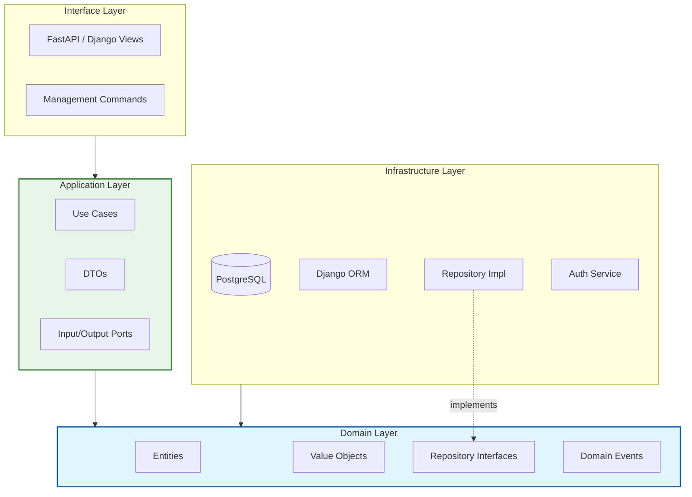

<div align="center">

# 🛒 E-Commerce - Clean Architecture & DDD

### Enterprise System with CQRS and Event-Driven Architecture

[](https://www.python.org/)
[](https://www.djangoproject.com/)
[](https://www.postgresql.org/)
[](https://fastapi.tiangolo.com/)
[](LICENSE)

</div>

---

## 📋 Overview

**E-Commerce** is an enterprise-grade system designed strictly following **Clean Architecture**, **Domain-Driven Design (DDD)**, and **CQRS** patterns. It decouples business logic from external frameworks, ensuring maintainability, testability, and scalability.

This project demonstrates how to build complex Python applications where the core business rules are protected from technological changes (like swapping a database or web framework).

---

## 🏗️ Architecture

The system is organized into concentric layers, with dependencies pointing **inwards**. The inner layers know nothing about the outer layers.



### 🗝️ Key Technical Concepts

This documentation addresses critical architectural decisions often overlooked:

#### 1. The Dependency Rule
Source code dependencies must only point inward.
*   **Domain Layer**: Pure Python codes. NO dependencies on frameworks (Django, FastAPI), SQL, or HTTP. This is the heart of the software.
*   **Application Layer**: Orchestrates data flow. Contains `Use Cases` (e.g., `CreateOrder`). Depends only on the Domain.
*   **Infrastructure Layer**: Implements details. Here reside the Database adapters, File System I/O, and 3rd party API clients.

#### 2. DTOs vs Entities vs ORM Models
We strictly separate data structures to prevent coupling:
*   **Domain Entities**: Rich objects with behavior and business rules (e.g., `cliente.activar()`).
*   **ORM Models**: Database schema representations (Django Models). Used **only** in the Infrastructure Repository implementations.
*   **DTOs (Data Transfer Objects)**: Simple data containers used to pass data between the API (Interface) and Use Cases (Application). They have no behavior.

#### 3. Repository Pattern
We use the Repository pattern to decouple the Domain from the Data Access Layer.
*   **Interface**: Defined in the Domain (e.g., `IOrderRepository`).
*   **Implementation**: Defined in Infrastructure (e.g., `DjangoOrderRepository`).
*   **Benefit**: We can swap Django ORM for SQLAlchemy or raw SQL without touching a single line of business logic.

---

## 🚀 Features

*   **Clean Architecture Strict Compliance**: No framework leakage into business logic.
*   **CQRS Ready**: Separate models for Reading (Queries) and Writing (Commands).
*   **Event-Driven**: Domain events for side effects (e.g., "Email sent when Order Placed").
*   **Dual Framework Support**: Uses Django for Admin/ORM and FastAPI for high-performance Async APIs.
*   **Robust Error Handling**: Centralized exception handling mapped to HTTP status codes.

---

## 🛠️ Tech Stack

| Component | Technology | Version | Purpose |
|ops |---|---|---|
| **Language** | Python | 3.14+ | Core logic and typing |
| **Framework** | Django | 6.0 | ORM, Admin Panel, Migrations |
| **API** | FastAPI | 0.128 | High-performance Async REST API |
| **Database** | PostgreSQL | 18.1 | Primary Data Store |
| **Linting** | Black / Flake8 | Latest | Code quality and formatting |

---

## 📂 Project Structure

```bash
src/
├── domain/                  # 🧠 CORE BUSINESS LOGIC (Pure Python)
│   ├── entities/            # Business Objects (User, Order)
│   ├── value_objects/       # Immutable attributes (Email, Money)
│   ├── repositories/        # Interfaces only!
│   └── events/              # Domain Events
│
├── application/             # 💼 ORCHESTRATION
│   ├── use_cases/           # Application specific business rules
│   └── dto/                 # Data contracts
│
├── infrastructure/          # 🔌 ADAPTERS & IO
│   ├── persistence/         # Repository Implementations (Django ORM)
│   ├── logging/             # Logging adapters
│   └── config/              # Framework settings
│
└── interfaces/              # 🗣️ DELIVERY MECHANISMS
    ├── api/                 # FastAPI Routes
    └── management/          # CLI Commands
```

---

## 💻 Getting Started

### Prerequisites
*   Python 3.14+
*   PostgreSQL

### Installation

1.  **Clone the repository**
    ```bash
    git clone https://github.com/your-repo/ecommerce.git
    cd ecommerce
    ```

2.  **Create Virtual Environment**
    ```bash
    python -m venv venv
    # Windows:
    .\venv\Scripts\activate
    # Linux/Mac:
    source venv/bin/activate
    ```

3.  **Install Dependencies**
    ```bash
    pip install -r requirements.txt
    ```

4.  **Configuration**
    Copy the example env file and update your DB credentials:
    ```bash
    cp .env.example .env
    ```

5.  **Run Migrations**
    ```bash
    python manage.py migrate
    ```

6.  **Run Development Server**
    *   **Django (Admin/Commands)**: `python manage.py runserver`
    *   **FastAPI (API)**: `uvicorn src.main:app --reload`

---

## 🧪 Testing

We use `pytest` for comprehensive testing.

```bash
# Run all tests
pytest

# Run only domain tests (Fast, no DB)
pytest tests/domain/

# Run with coverage
pytest --cov=src --cov-report=html
```

---

## 📚 Documentation & UML

This project maintains detailed UML diagrams to visualize the architecture.
See [**docs/UML_DIAGRAMS.md**](docs/UML_DIAGRAMS.md) for:
*   Class Diagrams (Domain relationships)
*   Sequence Diagrams (Request flow)
*   ER Diagrams (Database Schema)

---

<div align="center">
    <sub>Built with ❤️ using Clean Architecture principles.</sub>
</div>
