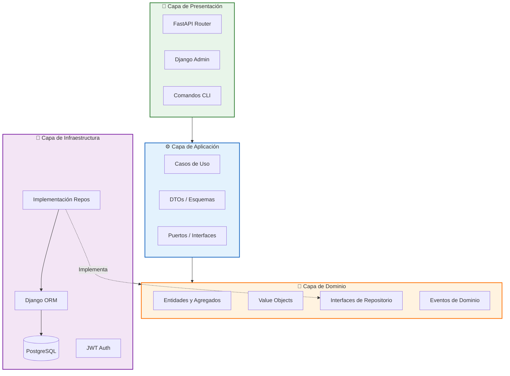
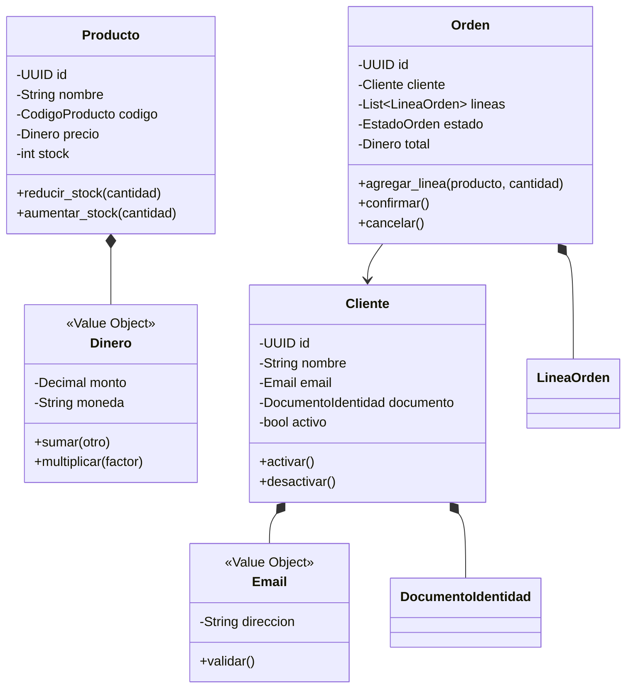
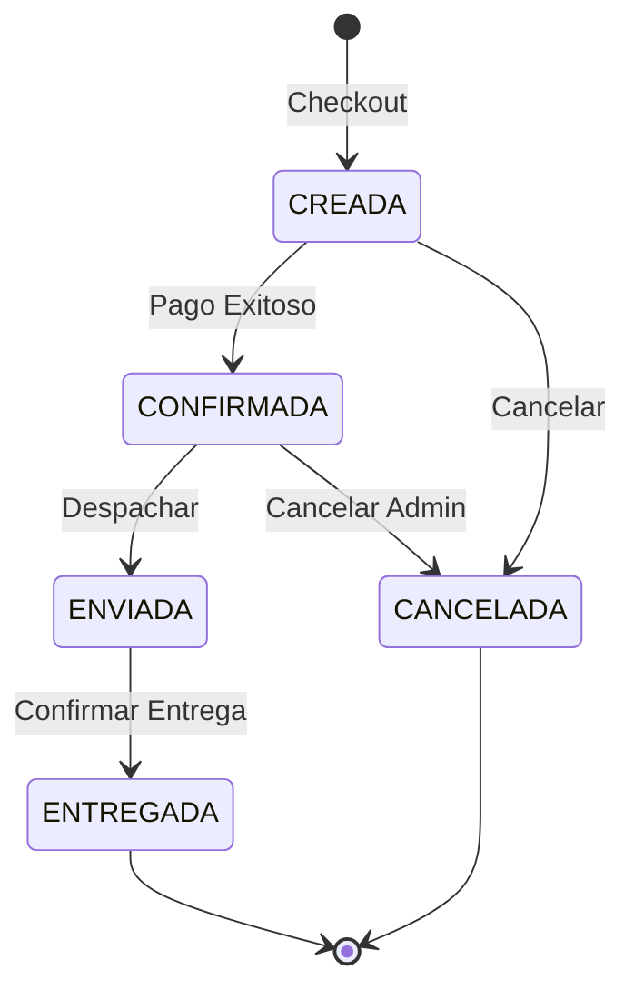
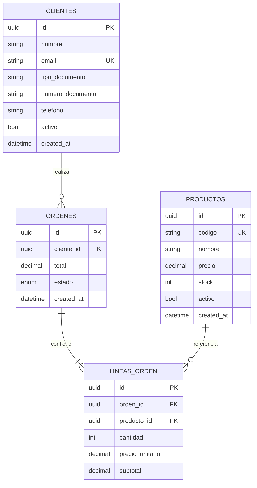

# 🏗️ Arquitectura del Sistema

## Visión General

La arquitectura está diseñada concéntricamente siguiendo los principios de **Clean Architecture**. Las dependencias fluyen **únicamente hacia adentro**, protegiendo el Dominio de cambios externos.

```
┌─────────────────────────────────────────────────────────────────┐
│                    📱 INTERFACES LAYER                          │
│         FastAPI Router │ Django Admin │ CLI Commands            │
├─────────────────────────────────────────────────────────────────┤
│                    ⚙️ APPLICATION LAYER                         │
│           Use Cases │ DTOs │ Commands │ Queries                 │
├─────────────────────────────────────────────────────────────────┤
│                    💎 DOMAIN LAYER (Núcleo)                     │
│    Entities │ Value Objects │ Repository Interfaces │ Events   │
├─────────────────────────────────────────────────────────────────┤
│                    🔌 INFRASTRUCTURE LAYER                      │
│      Django ORM │ PostgreSQL │ JWT │ Auditing │ External APIs   │
└─────────────────────────────────────────────────────────────────┘
                              ▲
                              │
              Las dependencias fluyen HACIA ADENTRO
```

## Diagrama de Componentes



## 🧠 Modelado de Dominio

### Entidades Principales



### Ciclo de Vida de Órdenes



## 💾 Base de Datos

### Esquema ER


