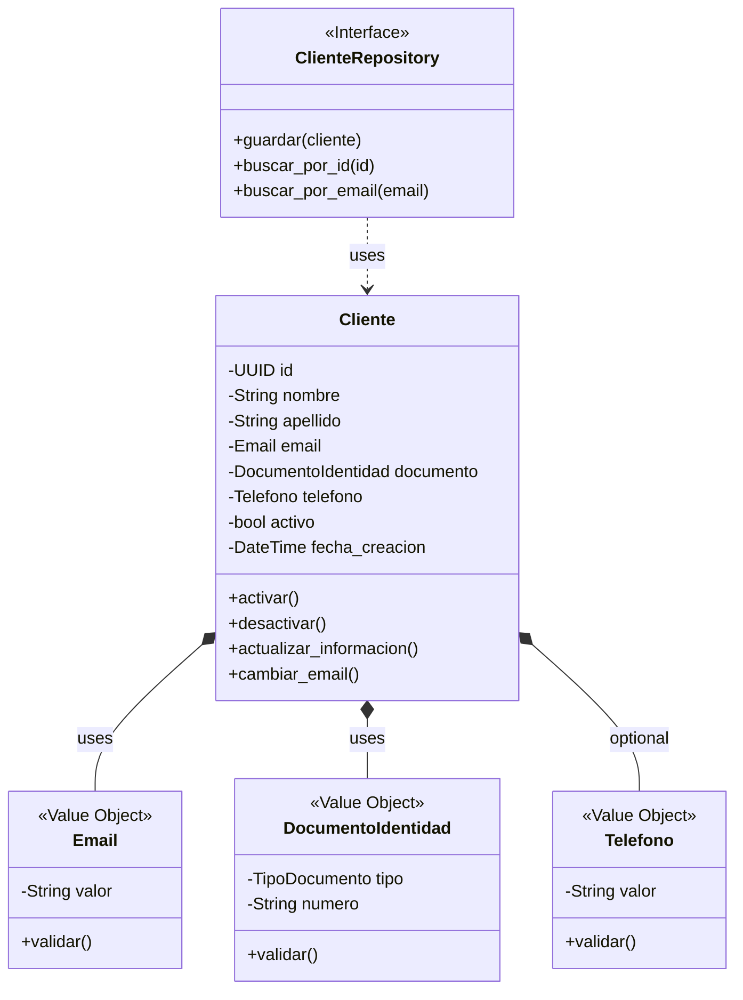
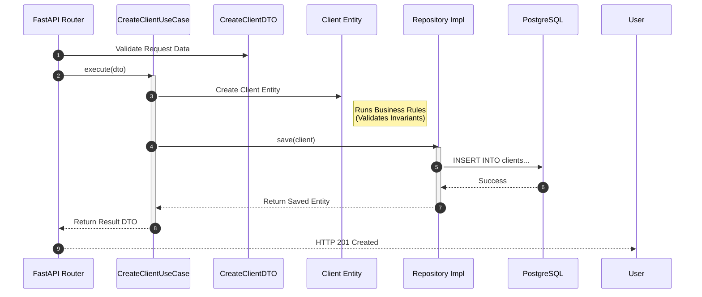
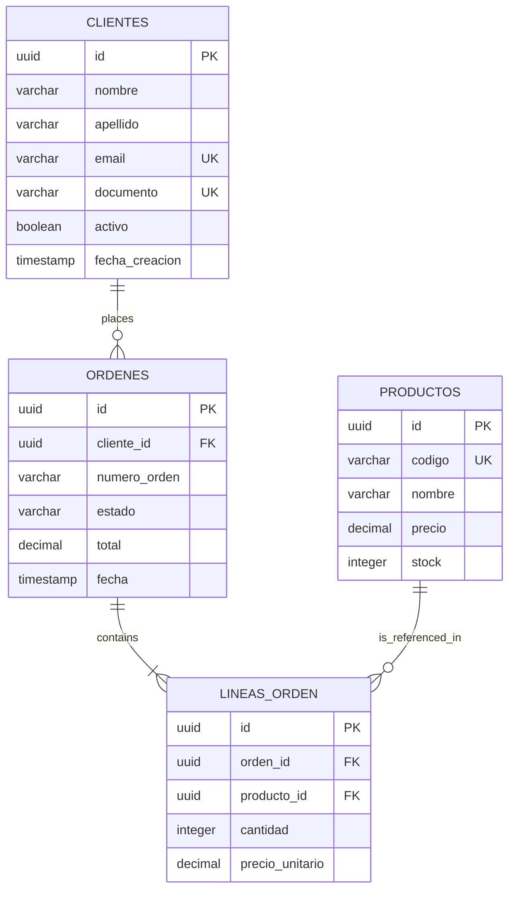
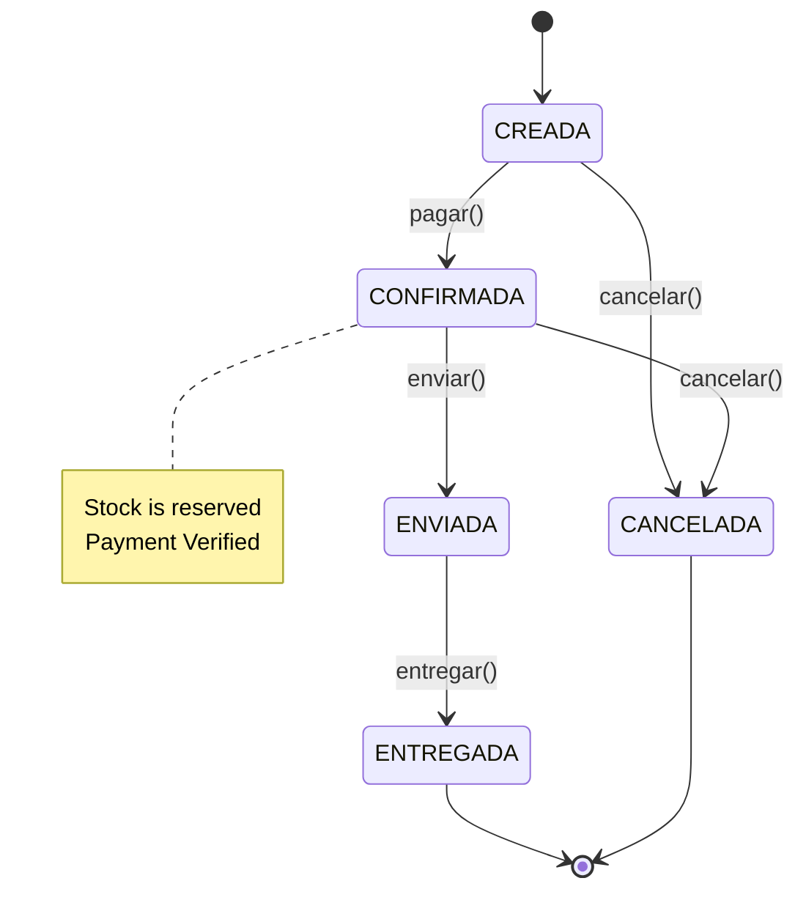
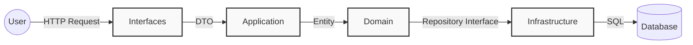

# 🎨 UML Diagrams - E-Commerce Clean Architecture

This document contains the architectural diagrams for the E-Commerce system.
You can view these diagrams natively on GitHub, GitLab, or using a Mermaid Preview plugin in VS Code.

## 📋 Table of Contents

- [Class Diagram - Domain Layer](#class-diagram---domain-layer)
- [Sequence Diagram - Create Client](#sequence-diagram---create-client)
- [Component Diagram](#component-diagram)
- [ER Diagram - Database](#er-diagram---database)
- [State Diagram - Order](#state-diagram---order)

---

## Class Diagram - Domain Layer

This diagram illustrates the **Client Aggregate** and its related Value Objects. Note the strict use of Value Objects for validation.



---

## Sequence Diagram - Create Client

Shows the flow of data from the API endpoint down to the database and back, highlighting the **Clean Architecture** layers.



---

## Component Diagram

High-level overview of the architectural layers and their responsibilities.

```mermaid
graph TD
    subgraph Presentation [Presentation Layer]
        API[FastAPI Router]
        Admin[Django Admin]
        CLI[Manage.py Commands]
    end

    subgraph Application [Application Layer]
        UseCases[Use Cases]
        DTOs[Data Transfer Objects]
        Ports[Input Ports]
    end

    subgraph Domain [Domain Layer (Core)]
        Entities[Entities]
        VO[Value Objects]
        RepoInt[Repository Interfaces]
        Events[Domain Events]
    end

    subgraph Infrastructure [Infrastructure Layer]
        RepoImpl[Repository Implementations]
        ORM[Django ORM]
        Postgres[(PostgreSQL)]
        EmailSvc[Email Service]
    end

    Presentation --> Application
    Application --> Domain
    Infrastructure --> Domain
    
    RepoImpl -. implements .-> RepoInt
    RepoImpl --> ORM
    ORM --> Postgres
    
    style Domain fill:#ffecb3,stroke:#ff6f00,stroke-width:2px,color:black
    style Application fill:#e3f2fd,stroke:#1565c0,stroke-width:2px,color:black
```

---

## ER Diagram - Database

The physical schema implementation in PostgreSQL.



---

## State Diagram - Order

The lifecycle of an Order entity, demonstrating domain logic constraints.



---

## Data Flow Architecture


